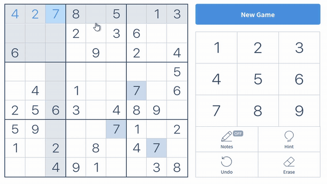

# Sanjay's Sudoku Solver
A basic interactive backtracking sudoku solver written in Python.  

This was my first project involving data structures. During development
of this project, I received the foobar invite link, hence my decision to 
include a link to this repository in my foobar application. This is also 
my first attempt at a GitHub repository.

## Features
  - Interact with web-based sudoku puzzles through emulating mouse and keyboard movements
  - Generate unique sudoku puzzles without using seed data
### Screenshots 

### Requirements
This program requires pywin32, keyboard, and numpy:
```sh
pip install pywin32
pip install keyboard
pip install numpy
```

### Known Bugs 
  - This solver was built in Python 3.7 and has not been tested for Python 2.x
  - Additionally, this solver has only been tested on Firefox on a 1920x1080 monitor; 
  since the solver extracts board data through webscraping, this would not affect its 
ability to solve the puzzle. It may affect win32con's ability to accurately emulate mouse 
movements to blank spaces on the board. This can be solved using selenium, though 
I felt the need for a seperate headless browser made the program more clunky. 
  - The 'html_doc' variable in the 'board.&#8203;py' module would need to be changed 
  to the default save path for your browser
  - The generator module occasionally produces 'dumb' Sudokus. For more information,
  read my long-winded explanation below:

    A well-formed Suduko should only possess one solution; a sudoku that can only be 
    solved one way can be solved using logic as opposed to having to guess values for
    blank spaces. 
    
    One easy fix would be to have my solver module count the solutions it found.
    However, due to the nature of a recursive backtracking algorithm, implementing 
    a method to find all possible solutions would require a complete redesign of
    my algorithm.

License
----

MIT
